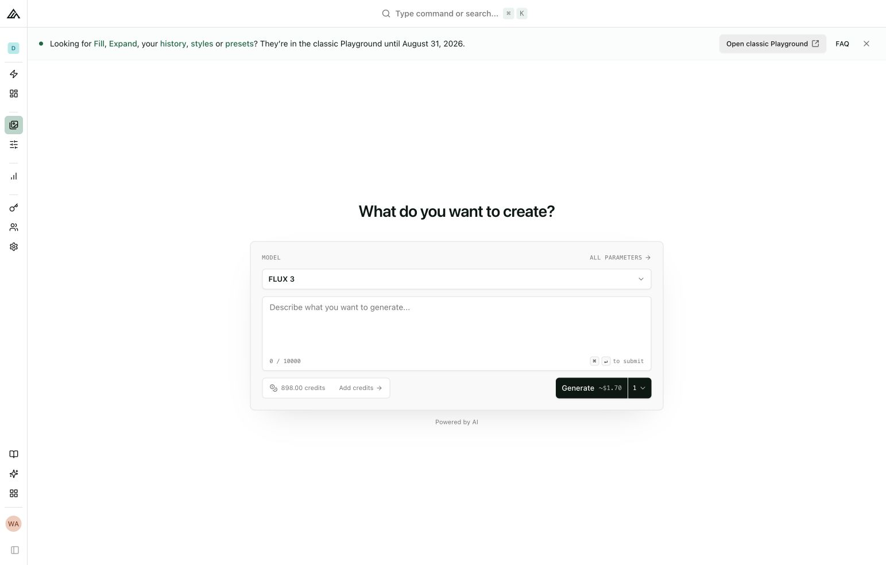

# BFL product UI study

Clean-room research of the Black Forest Labs Dev Playground frontend, captured on 2026-08-29 from assets delivered to an authenticated browser session.

The goal is not to clone BFL or reuse proprietary code. The goal is to understand the product grammar, learn the stack, and build an original portfolio prototype that feels credible beside their product.

## High-confidence stack

| Layer | Observed technology | Evidence |
| --- | --- | --- |
| Application | Next.js 15.4.11, App Router | `/_next/static/chunks/app/...` route chunks; runtime version string |
| UI runtime | React 19.2.0 canary | React runtime version string |
| Styling | Tailwind CSS 3-style compiled output | Tailwind utility classes and `--tw-*` variables |
| Component approach | shadcn/ui-style source-owned components | semantic HSL tokens, `data-slot`, Radix contracts, `cn()` helper |
| Primitives | Radix UI | dialog/select/popover contracts and Radix runtime strings |
| Variants | class-variance-authority | variant factory used by Button and other primitives |
| Class composition | clsx + tailwind-merge | `cn(...inputs) = twMerge(clsx(inputs))` bundle shape |
| Icons | Lucide | rendered `lucide-*` SVG classes |
| Forms | React Hook Form | FormProvider, Controller and useFormContext wrapper pattern |
| Validation | Zod | object, enum, discriminated union and `safeParse` schema API |
| Server state | TanStack Query | QueryClient + QueryClientProvider, shared query defaults |
| Commands | cmdk | live `cmdk-root`, input, list, group and item DOM contracts |
| Drawers | Vaul | compiled `data-vaul-drawer-direction` selectors |
| Toasts | Sonner plus a legacy app toaster | Sonner chunk and notification DOM; app-shell Toaster |
| Charts | Recharts | dedicated chart chunk and compiled Recharts selectors |
| Layout panels | react-resizable-panels pattern | panel group contracts and accessible resize separator |
| Theme | next-themes wrapper | ThemeProvider wrapper and class-driven light/dark modes |
| Fonts | Geist Sans + Geist Mono | `next/font` variables and downloaded font declarations |
| Analytics | PostHog 1.268.1 + Clay Radar | proxied PostHog runtime and Clay scripts |
| API | custom `fetch` wrapper | cookie credentials, one refresh-and-retry on 401, typed error layer |
| Auth | custom BFL auth service | `auth.bfl.ai`, `/api/auth/refresh`, sign-in redirect |
| Other platform services | CookieYes, reCAPTCHA, Stripe, Sanity CDN | client assets and dashboard modules |

## Architecture in one sentence

A shared dashboard shell surrounds a client-heavy Playground island whose UI is driven by a central model/parameter registry, validated generation records, a small authenticated fetch layer, TanStack Query for server state, and context-local orchestration/analytics.

## Most useful ideas for a take-home

1. Make model capabilities data-driven instead of branching JSX by model.
2. Model async generations as a discriminated union (`pending`, `success`, `failed`/comparison states).
3. Separate the platform shell, feature domain, storage adapter, API adapter and analytics adapter.
4. Use semantic tokens and source-owned primitives instead of styling product screens ad hoc.
5. Add a command palette, keyboard shortcuts, code export and cost/time estimates as first-class product features.
6. Preserve the product grammar but change the information architecture and interaction model.

## Files

- [design-system.md](./design-system.md) — tokens, typography, layout, components and motion.
- [module-map.md](./module-map.md) — observed boundaries and a clean-room module tree.
- [portfolio-concept.md](./portfolio-concept.md) — an original node-based editor concept.

## Clean-room rules

- Use the official `geist` package and preserve its OFL license.
- Reimplement components from public library APIs and this behavioral specification.
- Do not copy BFL logos, illustrations, proprietary copy, source code or production font files.
- Use an original product name and an “independent concept” note in the portfolio.
- Keep the palette and interaction grammar as inspiration, then add a distinct accent and graph-specific visuals.

